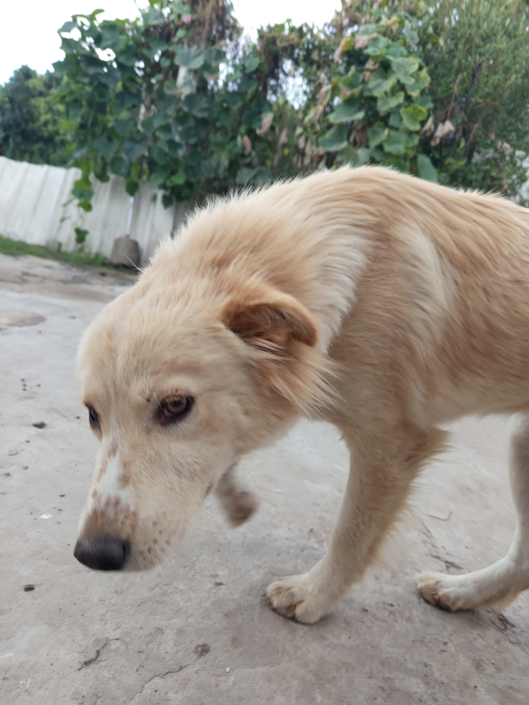

# Programación con objetos I

## Presentación Personal
- Hola, soy Carlos Genisetto, siempre me gustó el mundo de la tecnología, sobretodo los juegos y el deporte, actualmente me encuentro en el 3er cuatrimestre de Programación de Videojuegos, espero poder laburar de esto ya que me gustaría hacer varios juegos que tengo en mente. También se me da bien dibujar por lo que me interesa mucho el arte, el dibujo, los paisajes, aunque no me he metido de lleno en el tema. En esta carrera preferiría más programar, ya que eso es nuevo para mí, nunca lo había hecho. Estaría bueno tener esa facilidad para programar como la tengo al dibujar.

### Datos Personales
- Mi nombre es: Carlos Genisetto.
- Vivo en Merlo.
- Tengo 22 años.

### Otra Información
- Este es mi primer contacto con github.
- Tengo una perrita que se llama pelusa.

  Costo sacarle la foto, es re inquieta jsj.
- Me gusta jugar al futbol, padle, juegos virtuales competitivos.
- Me gusta el deporte en sí.
